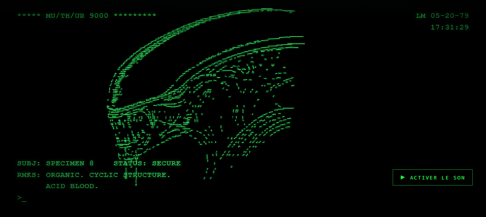
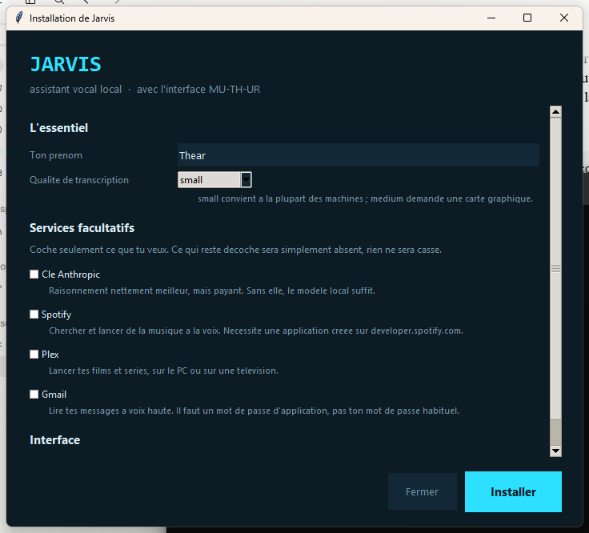

# Jarvis

Un assistant vocal qui tourne **entièrement sur votre machine**. Il écoute, il
répond, il agit. Aucune de vos phrases ne part sur internet — sauf si vous
activez explicitement la recherche web.

Il vient avec une seconde interface, **MU-TH-UR**, hommage au terminal de bord
du *Nostromo*.



## Ce qu'il sait faire

**Parler et comprendre** — mot d'activation, transcription locale par Whisper,
réponse par un modèle qui tourne chez vous via Ollama. Une clé Anthropic peut
être ajoutée pour un raisonnement plus fin, mais rien ne l'exige.

**Lancer ce qui est installé** — applications, jeux Steam, programmes du
Microsoft Store, recensés automatiquement sur la machine.

**Piloter les médias** — Spotify, Plex, YouTube, vos fichiers vidéo locaux.

**Envoyer sur les télévisions** — Chromecast, y compris myCANAL, Netflix et
Prime Video. Chacun de ces services a demandé une approche différente : là où
myCANAL et Netflix acceptent qu'une page ouvre elle-même sa session de
diffusion, Prime n'expose rien et passe par une recopie d'écran.

**Chercher sur le web** — l'outil rapporte des faits datés et écarte le hors
sujet, plutôt que de rendre une liste de sites.

**Commander l'ordinateur** — extinction, redémarrage, verrouillage, volume,
avec un délai pendant lequel on peut se raviser.

**Depuis un téléphone** — deux interfaces web installables comme des
applications, avec dictée vocale. Joignables de partout via un réseau privé.

## Installation

Windows 10 ou 11, Python 3.11 ou plus récent, 8 Go de RAM, 10 Go d'espace
libre. Une carte NVIDIA accélère nettement la transcription sans être
obligatoire.

Téléchargez l'archive, décompressez, et double-cliquez :

- **`INSTALLER_FENETRE.bat`** — assistant en fenêtre
- **`INSTALLER.bat`** — le même en console



L'assistant vérifie les prérequis, installe les dépendances et le modèle,
télécharge la voix française, pose les questions nécessaires, recense vos
applications et place les raccourcis. Une quinzaine de minutes, surtout du
téléchargement.

**Tout est facultatif sauf le cœur.** Refuser Spotify n'empêche rien d'autre de
fonctionner : la commande sera simplement absente.

Le détail se trouve dans [INSTALLATION.md](INSTALLATION.md).

## Quelques phrases pour commencer

```
Hey Jarvis, quelle heure est-il
Hey Jarvis, ouvre Chrome
Hey Jarvis, mets Arte sur la télé du bas
Hey Jarvis, mets Stranger Things sur Netflix sur la télé du bas
Hey Jarvis, cherche sur internet qui a gagné hier soir
Hey Jarvis, mode maman
Hey Jarvis, éteins le PC
```

## Comment c'est fait

Le cœur est une chaîne simple : détection du mot d'activation, transcription,
puis un modèle de langage avec des outils.

Ce qui compte davantage, c'est ce qui se trouve **avant** le modèle. Un
assistant vocal domestique tourne sur un petit modèle, qui se trompe d'outil et
invente des arguments. Les commandes courantes passent donc par une chaîne de
raccourcis déterministes — des expressions régulières et de la recherche floue —
et le modèle n'est sollicité que pour ce qui n'a pas été reconnu. Le résultat
est plus rapide et beaucoup plus fiable.

Le même principe gouverne les outils : ils font le travail complet plutôt que
d'attendre du modèle qu'il enchaîne les étapes. La recherche web, par exemple,
juge elle-même si les extraits répondent, et va lire la page dans le cas
contraire.

Les intégrations reposent sur ce que les services exposent réellement, relevé
en observant leur trafic plutôt qu'en devinant. Les notes de ces relevés sont
dans `recettes/` — le catalogue de myCANAL par EpgId, la recherche GraphQL de
Netflix, la page de lecture de Prime.

## Ce que ça ne fait pas

Ce n'est pas un produit. C'est un projet personnel, écrit pour une maison, et
il s'en ressent : Windows uniquement, français uniquement, et certaines
intégrations supposent une installation qui ressemble à la mienne.

Les services de streaming changent leurs interfaces sans prévenir. Ce qui
marche aujourd'hui peut cesser demain — les relevés dans `recettes/` sont là
pour rendre la réparation possible.

## Licence

Code sous licence MIT — voir [LICENSE](LICENSE).

L'esthétique MU-TH-UR est un **hommage non commercial** à *Alien* (1979). Le
nom, le logo Nostromo et l'univers appartiennent à 20th Century Studios ; ce
projet n'est ni affilié ni approuvé par eux, et n'est vendu sous aucune forme.
