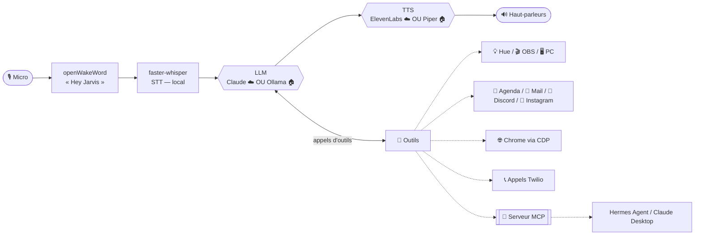

# 🤖 Jarvis — assistant vocal local

*[English version](README.en.md)*


Un assistant vocal en français qui tourne **sur ta machine**. Dis *« Hey Jarvis »*,
parle naturellement : il raisonne avec un LLM, utilise une boîte à outils extensible
(domotique, PC, web, téléphone…) et te répond à voix haute. Deux modes au choix, en
une ligne de config : **cloud** (Claude + ElevenLabs) ou **100 % local hors ligne**
(Ollama + Piper).

> Projet perso partagé tel quel. Cible **Windows 11**, nécessite un micro et (en mode
> cloud) une clé API Anthropic. La plupart des intégrations sont **optionnelles** et se
> désactivent proprement si non configurées.

## ✨ Fonctionnalités

- 🎙️ **Tout à la voix** — mot d'activation (openWakeWord), transcription locale (Whisper), réponses parlées
- 👁️ **Vision de l'écran** — « c'est quoi cette erreur ? », « lis ça », « traduis » (capture → LLM)
- 💡 **Domotique** — Philips Hue (allumer, luminosité, couleur), ambiances/scènes
- 🎬 **Streaming** — contrôle d'OBS (direct, enregistrement, scènes, replay)
- 🖥️ **Contrôle PC** — lancer des apps, média/volume, stats GPU/CPU/RAM en direct
- 📅 **Agenda** — Google Agenda sur **tous** tes agendas (y compris abonnés iCal), création/suppression avec confirmation
- 📧 **Mail** — résumés Gmail et rédaction
- 💬 **Discord** — mentions + récap des messages du jour
- 📸 **Instagram** — abonnés & vues des vidéos vs la veille (multi-comptes)
- 🍽️ **Réservations web** — réserve resto/rendez-vous via un vrai navigateur (Playwright)
- 🌐 **Assistant navigateur** — résume/traduit l'onglet actif, gère les onglets, agit sur les pages (ton vrai Chrome)
- 📞 **Appels téléphoniques** — Twilio : jouer un message, ou une vraie conversation temps réel
- 🧠 **Mémoire long terme** — retient tes préférences, tes proches, tes projets
- 🎭 **Personnalités** — majordome sarcastique, neutre, concis — changeable à la voix
- 🏠 **Présence** — ping ton téléphone, déclenche des scènes quand tu pars/reviens
- 🌤️ **Utilitaires** — météo, minuteurs, heure/date
- 🔌 **Serveur MCP** — expose les outils domotique/PC à tout client MCP (Claude Desktop, Hermes…)

## 🎬 Démo

> 📺 *Vidéo / GIF de démo à venir — placeholder.*

## 🏗️ Architecture



## ☁️ Cloud vs 🏠 Local

| | **cloud** (défaut) | **local** (hors ligne) |
|---|---|---|
| LLM | Claude (API Anthropic) | Ollama (`qwen3.5:4b`…) |
| Voix | ElevenLabs | Piper (français) |
| Transcription | faster-whisper (local) | faster-whisper (local) |
| Qualité | maximale | bonne (selon le modèle) |
| Coût | à l'usage | gratuit |
| Vie privée | appels API | **rien ne sort de la machine** |
| Matériel | léger | GPU recommandé |

Bascule en une ligne : `mode: cloud` ou `mode: local`. Voir [docs/local.md](docs/local.md)
pour le bilan honnête de fiabilité (un modèle 7B gère bien les outils domotique/PC ;
les **features à vision comme le navigateur & les réservations restent cloud recommandé**).

**Matériel local (honnête) :** Whisper `medium` ≈ 2–3 Go VRAM, `qwen3.5:4b` (Q4) ≈ 3 Go —
une carte **6 Go** (RTX 2060/3060) fait tourner les deux confortablement. Le `qwen3.5:9b`
(~6 Go) demande plus de marge. Piper est temps réel sur CPU. `python scripts/doctor.py`
conseille le modèle selon ta VRAM.

## 🚀 Démarrage rapide

Prérequis : **Python 3.13**, [uv](https://docs.astral.sh/uv/), Windows 11, un micro.

```bash
uv sync
uv run playwright install chromium        # pour les réservations / le navigateur
copy config.example.yaml config.yaml      # puis remplis ce dont tu as besoin
uv run python jarvis14.py
```

Dis **« Hey Jarvis »**. Le seul réglage strictement requis est `anthropic.cle` (mode
cloud) ou un modèle local (mode local). Tout le reste est optionnel.

Débutant complet ? Vois **[INSTALL_WITH_AI.md](INSTALL_WITH_AI.md)** — à coller dans
n'importe quelle IA gratuite, elle t'installe tout pas à pas. Ou lance l'installateur
interactif : `python scripts/setup.py`. Un souci ? `python scripts/doctor.py` diagnostique.

## 🤝 Se faire aider par une IA (gratuitement)

**Pour INSTALLER** (aucune connaissance requise) — l'option zéro friction : ouvre
n'importe quel chatbot gratuit ([Claude.ai](https://claude.ai),
[ChatGPT](https://chat.openai.com), [Gemini](https://gemini.google.com)), colle le
contenu de **[INSTALL_WITH_AI.md](INSTALL_WITH_AI.md)**, et laisse-toi guider.

**Pour MODIFIER / bidouiller le code**, plusieurs options gratuites :

- 🏠 **Cline ou Aider + Ollama** — un assistant de code **100 % local et gratuit**, dans
  l'esprit du projet. Le must si tu veux rester hors ligne.
- **Gemini CLI** — gratuit, limites généreuses, agentique dans le terminal.
- **GitHub Copilot Free** — niveau gratuit dans VS Code.
- **Cursor** (offre gratuite) — pratique pour découvrir, mais limité.
- **Claude Code** — si tu l'as (c'est ce qui a construit ce projet).

Aucun outil n'est imposé : prends celui qui te convient.

## ⚙️ Configuration

Tout est dans un unique `config.yaml` **non versionné** (copié depuis
`config.example.yaml`, qui documente chaque clé). Guides par intégration :

| Intégration | Guide |
|---|---|
| Cloud vs local, Ollama, Piper | [docs/local.md](docs/local.md) |
| Philips Hue | [docs/hue.md](docs/hue.md) |
| OBS | [docs/obs.md](docs/obs.md) |
| Google Agenda + iCal | [docs/agenda.md](docs/agenda.md) |
| Détection de présence | [docs/presence.md](docs/presence.md) |
| Bot Discord | [docs/discord.md](docs/discord.md) |
| Appels Twilio | [docs/appels.md](docs/appels.md) |
| Navigateur (Chrome CDP) | [docs/navigateur.md](docs/navigateur.md) |
| Réservations web | [docs/reservation.md](docs/reservation.md) |
| Instagram | [docs/instagram.md](docs/instagram.md) |
| Serveur MCP | [docs/mcp.md](docs/mcp.md) |
| **Latence perçue (UX)** | [docs/latency.md](docs/latency.md) |

## 🛡️ Éthique & Sécurité

La confiance est intégrée, pas rajoutée :

- **Confirmation vocale** avant toute action irréversible (envoi de mail, réservation, suppression, appel…).
- **Les appels se présentent** honnêtement : *« Bonjour, je suis l'assistant vocal automatisé de [prénom]… »* — jamais en se faisant passer pour un humain.
- **Jamais** de mot de passe ni de données bancaires saisis, jamais de paiement automatique.
- **Domaines protégés** (banque, impôts, santé) sur ton vrai navigateur = **lecture seule**.
- **Secrets & données perso jamais versionnés** (`config.yaml`, mémoire, logs, transcriptions d'appels, tokens OAuth — tous gitignorés).
- Au téléphone, Jarvis ne confirme que ce que tu as validé **avant** l'appel.

## 🗺️ Roadmap

- [ ] Contrôle des lampes vidéo Godox (aujourd'hui Hue seulement)
- [ ] Outils notes & rappels
- [ ] TTS en streaming phrase par phrase (voir [docs/latency.md](docs/latency.md))
- [ ] Boucle navigateur en 100 % local : la vision de `qwen3.5` lit déjà le texte des boutons (testé) — reste à valider le pilotage complet
- [ ] Rafraîchissement auto des tokens Instagram entre redémarrages (partiel aujourd'hui)

## 🤝 Contribuer

Ajouter un outil = un seul fichier dans `tools/` avec un décorateur `@outil(...)` — il
est auto-découvert, aucun câblage. Issues et PR bienvenues. Merci de ne jamais committer
de vrais secrets (vois `.gitignore`).

## 📄 Licence

MIT — voir [LICENSE](LICENSE).
