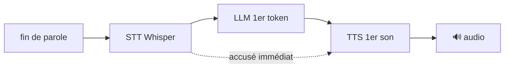

# Faire *paraître* l'assistant rapide (UX vocale)

Le savoir-faire le plus important d'un assistant vocal n'est pas d'être rapide, c'est
de **ne jamais laisser un silence**. Un humain qui réfléchit dit « alors… » ; un
assistant qui se tait pendant 3 secondes paraît cassé. Ce document décrit les
techniques utilisées (ou prévues) dans Jarvis, avec du vrai code du projet.

**Objectif chiffré :** premier son en **moins de 1,5 s** après la fin de ta phrase.

Légende : ✅ implémenté · 🟡 infra présente, à brancher · 🗺️ roadmap.

## Le pipeline (où part le temps)



Chaque flèche est une source de latence. L'astuce : **remplir les trous** au lieu de
les raccourcir.

## 1. Accusé de réception immédiat ✅

Dès que l'intention est comprise (un appel d'outil lent arrive), Jarvis dit une phrase
courte **avant** de lancer l'outil et le tour LLM suivant. Le silence est l'ennemi, pas
la latence.

```python
# jarvis14.py — repondre(), quand le LLM demande un outil "lent"
if (not accuse_donne and any(n in registre.noms_lents() for n in noms)):
    accuse_donne = True
    fil_accuse = threading.Thread(
        target=dire, args=(registre.phrase_attente(noms),), daemon=True)
    fil_accuse.start()          # « Je regarde ton écran. » pendant que l'outil tourne
```

Un outil se déclare « lent » avec sa propre phrase d'attente :

```python
@outil(nom="capture_screen", lent=True, phrase_attente="Je regarde ton écran.", ...)
```

## 2. Varier les phrases d'attente 🟡

Aujourd'hui chaque outil lent a **une** phrase d'attente fixe (`phrase_attente`).
Répétée, elle sonne robotique. Amélioration : tirer au hasard dans une liste, adaptée à
la personnalité active.

```python
# Idée : phrase_attente devient une liste, et on pioche
import random
ATTENTE = {
    "jarvis_sarcastique": ["Un instant.", "J'y suis presque.", "Deux secondes, monsieur."],
    "neutre":             ["Un instant.", "Je m'en occupe.", "Ça arrive."],
}
def phrase_attente(mode):
    return random.choice(ATTENTE[mode])   # varie -> moins d'effet robot
```

## 3. TTS en streaming phrase par phrase 🟡 (le plus gros gain perçu)

Ne pas attendre la réponse complète du LLM : **commencer à parler dès la première
phrase**. L'infrastructure existe déjà dans le projet — il reste à la brancher sur le
flux (streaming) du LLM au lieu d'attendre la réponse entière.

```python
# jarvis14.py — dire_en_flux() découpe un générateur de fragments et parle au fil de l'eau
def dire_en_flux(morceaux):
    tampon = ""
    for fragment in morceaux:              # <- fragments du LLM en streaming
        tampon += fragment
        while (trouve := FIN_PHRASE.match(tampon)):   # dès qu'une phrase est complète
            phrase = trouve.group(1)
            tampon = tampon[len(phrase):]
            fil.put(phrase)                # -> jouée immédiatement, sans attendre la suite
```

**À faire (🗺️)** : dans `repondre`, remplacer le `dire(texte)` final (qui attend toute
la réponse) par un appel streaming — `provider.repondre_flux(...)` → `dire_en_flux(...)`.
Gain typique : le 1er mot sort ~1 s plus tôt sur une réponse de 3 phrases.

## 4. Combler les trous longs 🗺️

Pendant un outil vraiment lent (recherche web, navigateur, appel API), au-delà d'un
seuil, glisser une phrase de progression naturelle :

```python
# Idée : un timer pendant l'exécution de l'outil
def avec_progression(fn, seuil=4.0, phrase="Je cherche encore, deux secondes."):
    t = threading.Timer(seuil, lambda: dire(phrase))
    t.start()
    try:    return fn()
    finally: t.cancel()
```

## 5. Réponses courtes par défaut ✅

En vocal, on veut 1 à 3 phrases sauf demande de détails. Moins de tokens = moins
d'attente ET meilleure UX. C'est cadré par le prompt système :

```
« Va à l'essentiel : donne d'abord l'information la plus importante, en une à trois
  phrases, sauf si on te demande des détails. »
```

## 6. Mesurer (sinon on optimise à l'aveugle) 🟡

Logger les timestamps de chaque étape pour savoir où part le temps. Aujourd'hui chaque
appel d'outil est déjà loggé (`logs/jarvis.log`) ; ajouter les jalons du pipeline :

```python
import time
t0 = time.time()
texte_dit = transcrire(audio);      LOG.info("STT %.2fs", time.time()-t0)
reponse   = provider.repondre(...);  LOG.info("LLM 1er token %.2fs", time.time()-t0)
dire(reponse);                       LOG.info("TTS 1er son %.2fs", time.time()-t0)
```

Cible : `TTS 1er son` < **1,5 s**. Si c'est le LLM qui domine → réponses plus courtes
ou modèle plus rapide (Haiku, ou `qwen3.5:4b` en local). Si c'est le TTS → streaming
(section 3). Si c'est le STT → `faster-whisper` sur GPU, `beam_size=1`.

## Récapitulatif des priorités

1. **Accusé immédiat** (✅) — supprime le silence, l'effet le plus fort.
2. **Streaming TTS** (🟡→🗺️) — le plus gros gain de latence perçue, infra prête.
3. **Réponses courtes** (✅) — gratuit, aide partout.
4. **Varier l'attente** (🟡) + **combler les trous** (🗺️) — le vernis anti-robot.
5. **Mesurer** (🟡) — pour viser le 1,5 s et savoir quoi optimiser.
